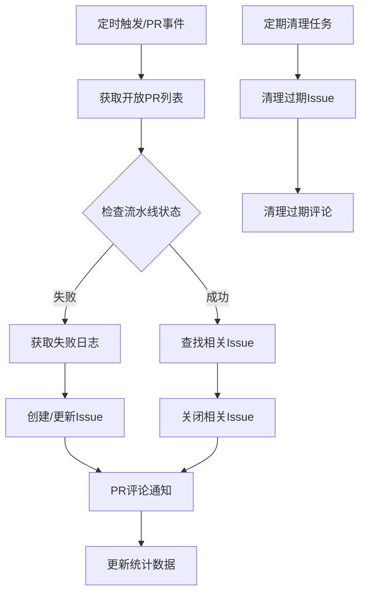

# 🔍 PR 流水线监控系统使用指南

## 📋 系统概述

PR 流水线监控系统是一个全自动化的 CI/CD 状态监控解决方案，能够：

- 🔄 **持续监控**：每 5 分钟自动检查所有开放 PR 的流水线状态
- 🚨 **智能告警**：流水线失败时自动创建详细的跟踪 Issue
- 💬 **及时反馈**：在 PR 中自动评论流水线状态和修复建议
- 🎯 **问题跟踪**：自动管理失败 Issue 的生命周期
- 🧹 **数据清理**：定期清理过期的监控数据

## 🏗️ 系统架构

### 核心组件

```
PR监控系统/
├── .github/workflows/pr-monitor.yml    # 主监控工作流
├── .github/scripts/
│   ├── pr-monitor.js                   # 核心监控逻辑
│   ├── cleanup-monitor-data.js         # 数据清理脚本
│   └── package.json                    # 依赖管理
└── docs/pr-monitor-guide.md           # 使用指南
```

### 工作流程



## 🚀 功能特性

### 1. 智能监控

- **多触发机制**：定时检查 + 事件驱动
- **状态识别**：准确识别 success/failure/pending 状态
- **日志分析**：自动提取关键错误信息
- **去重处理**：避免重复创建 Issue

### 2. 详细日志分析

```javascript
// 自动提取的错误信息类型
- ##[error] 错误标记
- npm ERR! 包管理错误
- FAILED 构建失败
- ERROR 通用错误
- 测试失败信息
```

### 3. Issue 自动管理

#### 失败 Issue 内容结构：
- **PR 基本信息**：编号、标题、分支、作者
- **工作流详情**：名称、运行 ID、提交信息
- **失败日志摘要**：关键错误信息提取
- **修复建议**：标准化的修复步骤
- **相关链接**：PR、工作流、提交地址

#### 标签管理：
- `ci-failure`：CI 失败标识
- `pr-monitoring`：监控系统标识
- `pr-{number}-failure`：特定 PR 标识

### 4. PR 评论反馈

#### 失败通知：
```markdown
## 🚨 流水线失败通知
**工作流**: React + Vite CI/CD Pipeline
**状态**: ❌ 失败
**运行时间**: 2025-01-24T10:30:00Z

### 📋 失败摘要
- **Code Quality & Linting**: [查看日志](...)
- **Unit Tests**: [查看日志](...)

### 🔗 详细信息
- **追踪 Issue**: #123
- **工作流详情**: [点击查看](...)
```

#### 成功通知：
```markdown
## ✅ 流水线通过通知
**工作流**: React + Vite CI/CD Pipeline
**状态**: ✅ 成功
**运行时间**: 2025-01-24T10:35:00Z

### 🎉 所有检查已通过！
已自动关闭 1 个相关失败 Issue:
- #123

PR 已准备好进行代码审查和合并。
```

## ⚙️ 配置说明

### 1. 基础配置

系统使用以下环境变量：

```yaml
env:
  GITHUB_TOKEN: ${{ secrets.GITHUB_TOKEN }}  # GitHub API 访问令牌
  REPOSITORY: ${{ github.repository }}       # 仓库信息
  FORCE_CHECK: 'false'                       # 强制检查模式
```

### 2. 监控频率设置

```yaml
schedule:
  - cron: '*/5 * * * *'  # 每 5 分钟检查一次
  
# 其他可选频率：
# - cron: '*/10 * * * *'  # 每 10 分钟
# - cron: '0 */1 * * *'   # 每小时
# - cron: '0 9-17 * * 1-5' # 工作日 9-17 点每小时
```

### 3. 清理策略配置

```javascript
const config = {
  issueMaxAge: 7 * 24 * 60 * 60 * 1000,    // Issue 过期时间：7天
  commentMaxAge: 30 * 24 * 60 * 60 * 1000,  // 评论过期时间：30天
  maxItemsPerRun: 50                         // 每次处理最大项目数
};
```

## 🔧 自定义配置

### 1. 修改监控目标工作流

在 `pr-monitor.js` 中修改工作流筛选条件：

```javascript
// 筛选特定工作流
const workflowRuns = runs.workflow_runs.filter(run => 
  run.name.includes('CI/CD Pipeline') &&  // 工作流名称包含
  run.head_branch === pr.head.ref         // 分支匹配
);
```

### 2. 自定义错误提取规则

```javascript
extractErrorLines(logContent) {
  const lines = logContent.split('\n');
  const errorLines = [];
  
  for (const line of lines) {
    // 添加自定义错误模式
    if (line.includes('##[error]') || 
        line.includes('CUSTOM_ERROR') ||     // 自定义错误标识
        line.includes('DEPLOY_FAILED')) {    // 部署失败标识
      errorLines.push(line);
    }
  }
  
  return errorLines;
}
```

### 3. 自定义 Issue 模板

修改 `generateFailureIssueBody` 方法中的模板：

```javascript
// 添加自定义字段
body += `## 🏷️ 自定义信息
- **环境**: ${process.env.NODE_ENV || 'unknown'}
- **构建工具**: Vite + React
- **负责团队**: Frontend Team

`;
```

## 🎛️ 操作指南

### 1. 启用监控系统

系统部署后会自动开始监控，无需手动启动。

### 2. 手动触发检查

在 GitHub Actions 页面手动触发 "PR 流水线监控系统" 工作流：

1. 进入 **Actions** 页面
2. 选择 **PR 流水线监控系统**
3. 点击 **Run workflow**
4. 可选择启用 **强制检查模式**

### 3. 查看监控统计

在工作流运行日志中查看统计信息：

```
📊 监控统计:
  检查的 PR: 5
  失败的流水线: 2
  成功的流水线: 3
  创建的 Issue: 1
  关闭的 Issue: 2
```

### 4. 管理监控 Issue

#### 查找监控相关 Issue：
- 使用标签筛选：`label:pr-monitoring`
- 搜索标题：包含 "流水线失败" 的 Issue

#### 手动处理 Issue：
- **重新打开**：如果问题仍然存在
- **添加标签**：如 `high-priority`、`help-wanted`
- **分配处理人**：@mention 相关开发者

## 🚨 故障排除

### 1. 监控系统不工作

**检查项目**：
- [ ] GitHub Token 权限正确
- [ ] 工作流文件语法正确
- [ ] 依赖安装成功
- [ ] 目标工作流名称匹配

**调试步骤**：
1. 查看 Actions 运行日志
2. 检查权限设置
3. 验证触发条件
4. 手动运行测试

### 2. Issue 创建失败

**常见原因**：
- Token 缺少 `issues:write` 权限
- 仓库禁用了 Issue 功能
- 标签不存在或无法创建

**解决方案**：
```bash
# 检查 Token 权限
curl -H "Authorization: token $GITHUB_TOKEN" \
     https://api.github.com/user

# 验证仓库设置
curl -H "Authorization: token $GITHUB_TOKEN" \
     https://api.github.com/repos/owner/repo
```

### 3. 日志获取失败

**原因分析**：
- 工作流运行时间过短
- 日志文件过大
- API 限制

**解决方案**：
- 增加错误处理
- 限制日志大小
- 添加重试机制

### 4. 性能问题

**优化策略**：
- 减少监控频率
- 限制 PR 检查数量
- 使用增量检查
- 并发处理限制

## 📈 监控指标

### 1. 系统健康指标

- **成功率**：监控任务成功执行比例
- **响应时间**：从失败到通知的时间间隔
- **准确率**：正确识别流水线状态的比例
- **覆盖率**：监控到的 PR 占总 PR 的比例

### 2. 业务指标

- **平均修复时间**：从失败通知到问题解决的时间
- **重复失败率**：同一 PR 多次失败的比例
- **Issue 处理效率**：Issue 从创建到关闭的时间
- **团队响应速度**：收到通知后的首次响应时间

## 🔄 版本升级

### 升级步骤

1. **备份配置**：保存自定义配置
2. **更新文件**：替换脚本文件
3. **测试功能**：验证核心功能正常
4. **恢复配置**：应用自定义设置
5. **监控运行**：观察系统运行状态

### 兼容性说明

- **Node.js**: >= 18.0.0
- **GitHub Actions**: 最新版本
- **GitHub API**: v4 (GraphQL) 和 REST API

## 🤝 贡献指南

### 功能建议

欢迎提交以下类型的改进：

- **新的错误模式识别**
- **更好的日志分析算法**
- **自定义通知模板**
- **性能优化方案**
- **集成外部工具**

### 提交流程

1. Fork 仓库
2. 创建功能分支
3. 实现并测试功能
4. 提交 Pull Request
5. 等待代码审查

---

## 📞 支持联系

如果遇到问题或需要技术支持，请：

1. 查看本文档的故障排除部分
2. 检查 [GitHub Issues](https://github.com/PercyLqx/devops-tools-navigator/issues)
3. 创建新的 Issue 描述问题
4. 提供详细的错误日志和环境信息

**系统状态**：✅ 已部署并正常运行  
**最后更新**：2025-01-24  
**版本**：v1.0.0